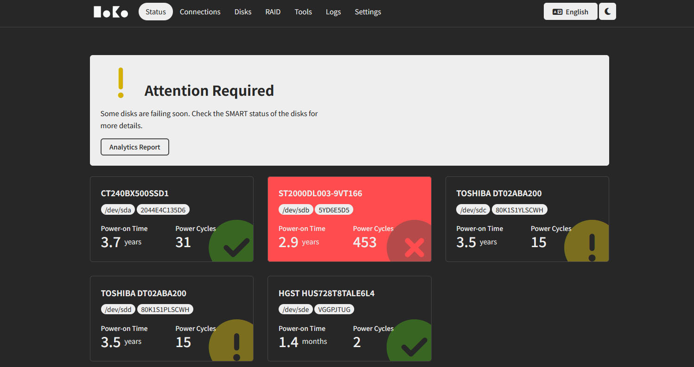
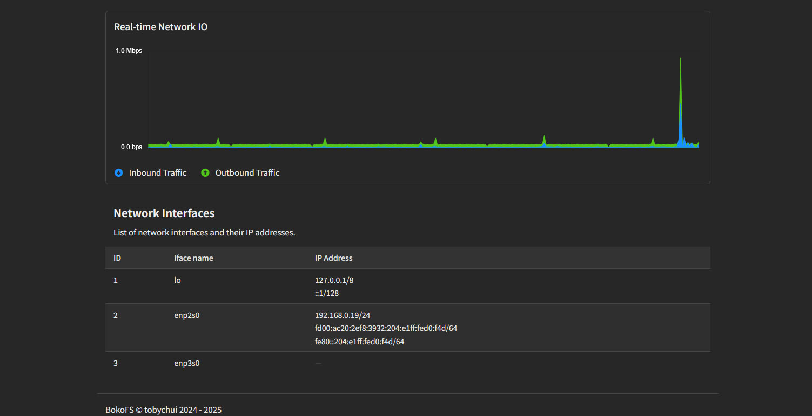
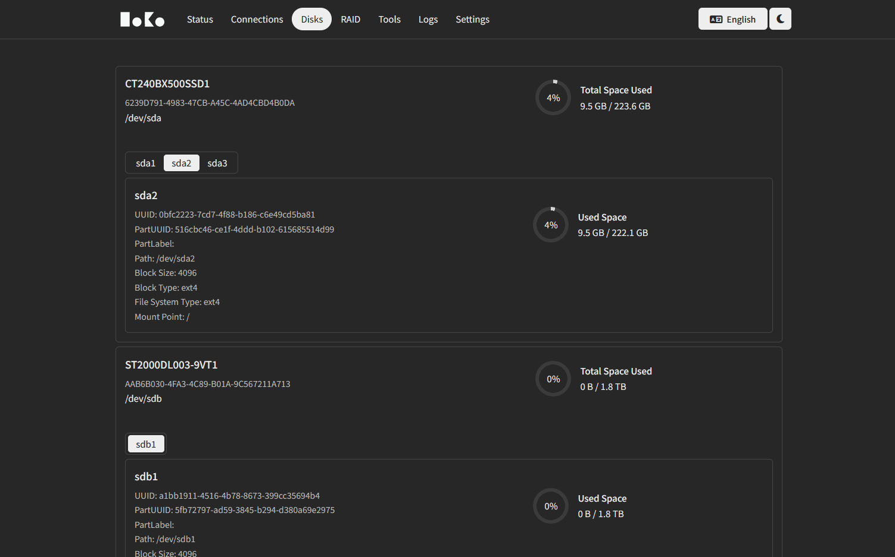

# bokoFS

bokoFS (ボコFS) is a self-contained, http based file system that is partially based on WebDAV but with a web UI and API supporting remote SMART health monitoring, RAID configurations and disk usage information. All within a single http server endpoint / port. 


**Disclaimer**

This project is in its very early stage of development and might not works on all systems. 

### Screenshots







### Build From Source

- Require go compiler 1.23.2 installed on your system
- Currently only support Debian (and Debian based distros)
- Require the following package installed
  - smartmontools (for disk SMART)
  - ffmpeg (for transcode offloading)
  - lsblk, blkid and df (usually come with Debian but make sure you have permission to run them)
  - (To be added)

```
cd src
go mod tidy
go build
./bokofsd
# For debug mode, run 
# ./bokofsd -debug=true 
```

### License

GPL
